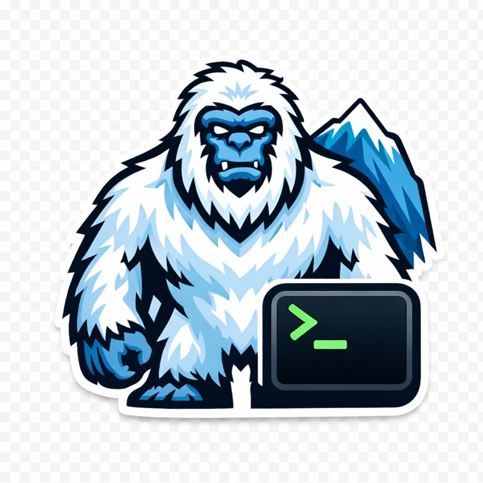

> **Note:** This is the repo of the new rewrite of yetty code. The old yetty code, is at https://github.com/zokrezyl/yetty-poc


<p align="center">
  
</p>

# Yetty

GPU-accelerated terminal with rich content. Pure C. Any language.

> **License:** Business Source License 1.1. Non-production use is free; production use requires a commercial license. See [LICENSE](LICENSE).

> **Status:** Early alpha — actively rewriting established concepts for efficiency.

## Vision

Terminals are stuck in the 1970s — text, maybe colors, that's it. Meanwhile, the rest of computing evolved to support rich graphics, animations, and interactive content.

**Yetty changes this.** A WebGPU-powered terminal where plots, images, videos, documents, and interactive widgets live alongside text — all scrolling together as one unified surface.

## Design Principles

- **Pure C, FFI-first** — no hidden costs, bind from Rust, Go, Python, Swift, Kotlin
- **Layered rendering** — text and graphics coexist, scroll together
- **Composable primitives** — simple (SDF shapes) and complex (cards)
- **Dirty-driven pipeline** — nothing runs unless something changed
- **GPU resource binding** — all buffers and textures packed into minimal GPU bindings

## Architecture

```
Terminal
  └── text-layer (libvterm)
  └── ypaint-layer
        ├── simple primitives (circles, boxes, lines, glyphs)
        └── complex primitives / cards
              └── yplot, yimage, yvideo, ydoc, ysheet...
```

Cards are nested ypaint canvases — same rendering model all the way down. A card can contain other cards, enabling recursive composition.

## Rich Content Cards

Cards are complex primitives that integrate seamlessly with the terminal grid. They scroll with text, share the GPU resource model, and can be nested.

| Card | Description | Status |
|------|-------------|--------|
| **yplot** | GPU-accelerated charts and data visualization | ✓ |
| **yimage** | Inline images (PNG, JPEG, WebP) | ✓ |
| **yvideo** | Video playback | In progress |
| **ygui** | Interactive widgets | ✓ |
| **yvnc** | Embedded VNC client | ✓ |
| **ymarkdown** | Markdown rendering/editing (WYSIWYG) | Porting |
| **ydoc** | Document viewer | Porting |
| **ysheet** | Spreadsheets | Porting |
| **yslide** | Presentations | Porting |
| **ythorvg** | SVG and Lottie animations | Planned |
| **ypdf** | PDF rendering | Planned |

## Core Features

| Feature | Description |
|---------|-------------|
| **MSDF fonts** | Crisp, scalable text at any zoom level |
| **Raster fonts** | Color emoji and bitmap glyphs |
| **SDF primitives** | GPU-rendered shapes with anti-aliasing |
| **Tiling workspaces** | Multiple terminals with window management |
| **Rolling scroll** | O(1) scroll — primitives never update coordinates |
| **ytrace logging** | Switchable trace points, near-zero cost when off |

## Platforms

| Platform | Status |
|----------|--------|
| Linux | ✓ |
| macOS | ✓ |
| Windows | In progress |
| Android | ✓ |
| WebAssembly | ✓ |

## Building

Build targets are defined in the `Makefile`. List available targets with:

```bash
make
```

Common build commands:

```bash
# Desktop (Linux/macOS) - release build with tracing
make build-desktop-ytrace-release

# WebAssembly
make build-webasm-ytrace-release

# Android (ARM)
make build-android-ytrace-release

# Android emulator (x86_64)
make build-android_x86_64-ytrace-release
```

## Usage

```bash
# Run with default shell
./build-desktop-ytrace-release/yetty

# Run with specific command
./build-desktop-ytrace-release/yetty -e 'htop'
```

## Documentation

| Document | Description |
|----------|-------------|
| [Design Overview](docs/design.md) | Architecture and design decisions |
| [Layered Rendering](docs/layered-rendering.md) | Layer stack and compositor |
| [GPU Resource Binding](docs/gpu-resource-binding.md) | Buffer packing and atlas textures |
| [ypaint](docs/ypaint.md) | Primitives and scrolling model |
| [Platform Abstraction](docs/platform.md) | PTY, event loop, input pipe |
| [Font System](docs/font.md) | Glyph rendering and atlas |
| [ytrace](docs/ytrace.md) | Logging and tracing |

## Contributing

We're developing intensively and moving fast. Contributions welcome:

- Code and bug fixes
- Documentation improvements
- Testing (coverage is still limited)
- Ideas and feedback

Share suggestions on [GitHub Discussions](https://github.com/zokrezyl/yetty/discussions).

## Dependencies

### Core
- **libvterm** — VT100/xterm terminal emulation
- **Dawn** — WebGPU implementation
- **FreeType** — Font rasterization
- **GLFW** — Cross-platform windowing
- **libuv** — Async I/O and event loop

### Optional
- **ThorVG** — SVG and Lottie rendering (planned)
- **PDFium** — PDF rendering (planned)

All dependencies use permissive licenses (MIT, BSD, Zlib, Apache-2.0).


---

*Your terminal, unchained.*
